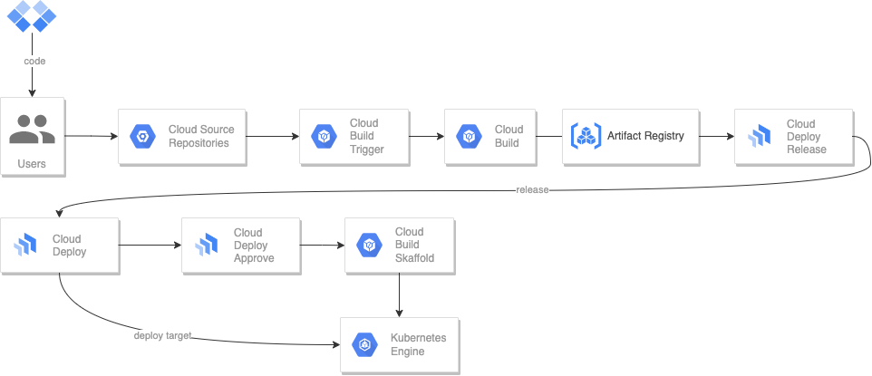

````
# Terraform

Storing terraform state in Google Cloud Storage Bucket. Using state in all stages.

0-common ->
* Create project
* Enable APIs
* Edit Organization Policy
* Add Owner to project
* Enable and set default computeengine service-account to Owner (helps in demo/PoC)

1-network ->
* Create VPC
* Create Private SQL-Allocation network with private service connection
* Create subnetwork in eu,us + pods/services secondary ip-ranges
* Create GKE-Proxy-only network for internal ip GKE Gateway Controller
* Create a set of firewall-rules. IAP, SSH, RDP, Internal, LB Healthcheck
* Create NAT + NAT router with set ips with dynamic port allocation.

2-environment ->
* Create GCLB reserved IP
* Create service-account GKE/Cloud Deploy & set IAM
* Create GKE-cluster with: DPv2, VPC-NATIVE, Private Cluster, Rapid channel, Cluster Autoscaling, K8S Config Connector, Workload 
Identity, Gateway API
* Create Cloud SQL instance with Mysql 8 + sql-user + sql-database
* Create Cloud Deploy pipeline
* Create Cloud Deploy target
* Create Pub/Sub topic + Subscription
* Create BigQuery dataset
* Create BigQuery connection with Cloud SQL
* Create Cloud Sourcerepo
* Create Cloud Build trigger

3-config ->
* Set project with gcloud command
* Get kubeconfig local
* Create wildcard-certificate
* Create GKE Gateways with Gateway API
* Annotate service-account in default and gmp-public
* GMP: kubectl apply cadvisor,kube-state-metrics,frontend,httproute
* Grafana: kubectl apply grafana

## Example
terraform init && terraform plan && terraform apply --auto-approve
terraform output -json | jq 'with_entries(.value |= .value)' > ../../app/values.json

# Deploy frontend and backend
Push frontend/backend to repo created by Terraform with TAG (v**). Application should should be triggered by Cloud Build and release will be created in Cloud Deploy.
````
